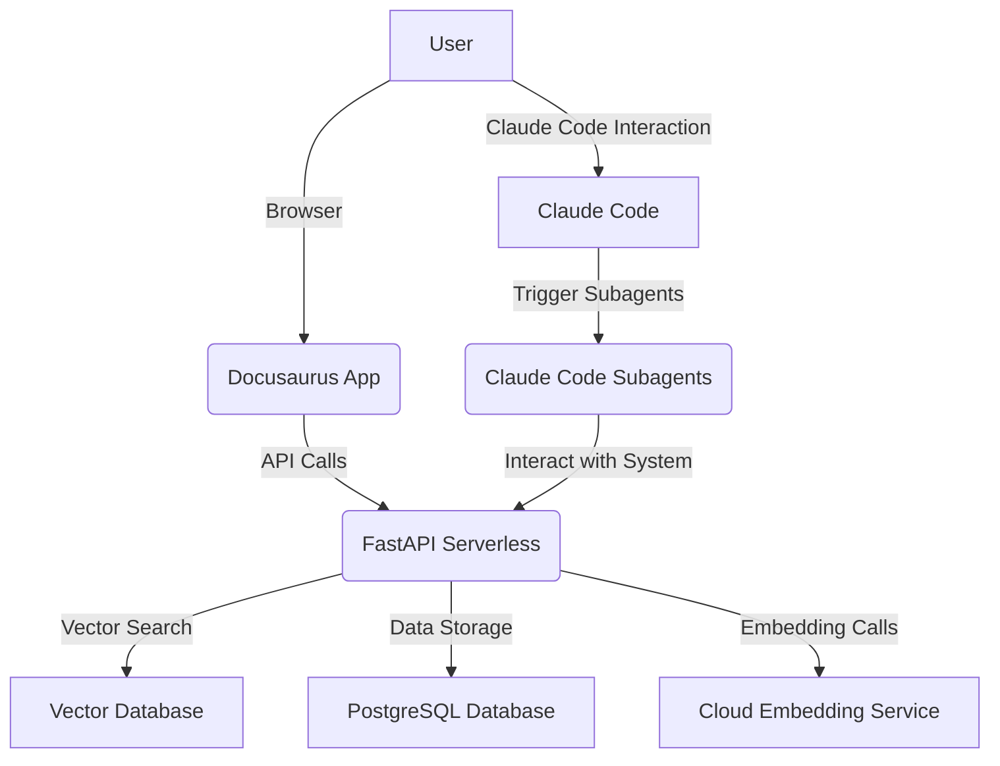

# Technical Design: Physical AI & Humanoid Robotics  Essentials Textbook with RAG Chatbot

**Branch**: `001-textbook-rag` | **Date**: 2025-12-06 | **Spec**: [specs/001-textbook-rag/spec.md](specs/001-textbook-rag/spec.md)
**Input**: Comprehensive technical architecture details from user prompt for `/sp.design`

## Summary

This document details the complete technical architecture for the AI-native textbook with an integrated RAG chatbot. It covers the full-stack system architecture, component breakdown for frontend and backend, the role of Claude Code Subagents, authentication, database design, personalization strategies, deployment considerations, security measures, performance optimizations, and the curriculum structure.

## 1. System Architecture

The system will employ a decoupled, full-stack architecture. The frontend, built with Docusaurus, will be a static site hosted on GitHub Pages. The backend, implemented with FastAPI, will handle RAG chatbot logic, embeddings, and data persistence, deployed as serverless functions. Qdrant will serve as the vector database, while Neon (PostgreSQL) will manage user data, chat history, and bookmarks. Claude Code Subagents will be integrated to enhance various functionalities.

## 2. Frontend Components (Docusaurus)

The frontend will be a Docusaurus application, focusing on a responsive and intuitive user experience.

-   **React Components**: Custom React components for the chatbot widget, interactive textbook elements, and potentially personalization controls.
-   **Docusaurus Configuration**: `docusaurus.config.js` will manage site metadata, plugins, presets, and themes.
-   **Auto-Sidebar Generation**: Docusaurus's inherent capabilities will be leveraged for automatic sidebar generation based on markdown file structure, ensuring easy navigation through the 6 chapters.
-   **Chat Widget**: A persistent, integrated chatbot widget allowing users to query the RAG system, with the ability to select text for context-aware questions.

## 3. Backend Components (FastAPI)

The FastAPI backend will serve as the core logic for the RAG chatbot and data management.

-   **FastAPI Endpoints**:
    -   `/api/v1/query`: (POST) For submitting natural language queries to the RAG chatbot, as defined in `chatbot-api.yaml`.
    -   `/api/v1/users`: (CRUD) User management.
    -   `/api/v1/chat-history`: (CRUD) Storing and retrieving user chat interactions.
    -   `/api/v1/bookmarks`: (CRUD) Managing user-specific textbook bookmarks.
    -   `/api/v1/personalization`: (GET/PUT) User personalization settings.
-   **RAG Service**: Core logic for orchestrating retrieval (from Qdrant), augmentation (with textbook content), and generation (using cloud LLMs).
-   **Embedding Pipeline**: Handles chunking of textbook content, generating vector embeddings using a cloud-provider free-tier embedding service, and storing them in Qdrant.
-   **Service Layer**: Business logic for interacting with databases (Qdrant, Neon), external APIs, and coordinating RAG flows.

## 4. Claude Code Subagents

Dedicated Claude Code Subagents will enhance specific functionalities, operating either in the background or triggered by specific events/user commands.

-   **Content Personalization Agent**: Adjusts content difficulty or provides supplementary materials based on user-level (e.g., beginner, intermediate, advanced) derived from interaction history or explicit user settings.
-   **Urdu Translation Agent**: Provides real-time or on-demand translation of textbook content into Urdu, potentially interacting with translation APIs.
-   **RAG Enhancement Agent**: Continuously monitors and refines the RAG system, potentially optimizing chunking strategies, embedding models, or retrieval algorithms based on performance metrics and user feedback.
-   **Code Example Generator**: Dynamically generates relevant code examples or interactive snippets based on the textbook content and user queries, useful for practical application of concepts.

## 5. Authentication

Authentication will be integrated using `better-auth.com`.

-   **better-auth.com Integration**: Leverages `better-auth.com` for secure user registration, login, and session management. This will offload complex authentication concerns.
-   **Background Survey**: A mechanism to conduct a background survey upon user registration or first login to gather preferences, skill level, or learning style, informing personalization efforts.

## 6. Database Specifics

-   **Qdrant (Vector Database)**:
    -   **Purpose**: Stores vector embeddings of textbook content for efficient semantic search and retrieval in the RAG process.
    -   **Schema**: Collections will be designed to store vectors along with metadata (e.g., `chapter_id`, `section_title`, `page_number`).
-   **Neon PostgreSQL (Relational Database)**:
    -   **Purpose**: Stores structured data for user profiles, chat history, bookmarks, and personalization settings.
    -   **Schemas**:
        -   `users`: `user_id` (PK), `email`, `hashed_password`, `personalization_settings_id` (FK), `created_at`.
        -   `chat_history`: `chat_id` (PK), `user_id` (FK), `query_text`, `response_text`, `context_text` (optional), `timestamp`.
        -   `bookmarks`: `bookmark_id` (PK), `user_id` (FK), `chapter_id`, `page_number/section_id`, `timestamp`.
        -   `personalization_settings`: `personalization_settings_id` (PK), `user_id` (FK), `language_preference`, `learning_level`, `theme`, etc.

## 7. Personalization Strategy

Personalization will be user level-based, adjusting content delivery and recommendations.

-   **User Level-Based Content Adjustment**: Content will be dynamically adapted based on the user's assessed learning level (e.g., beginner, intermediate, advanced). This could involve:
    -   Providing simpler explanations for beginners.
    -   Offering deeper dives or advanced challenges for advanced users.
    -   Suggesting relevant supplementary materials.
-   **Adaptive Learning Paths**: Potentially dynamically adjust navigation or highlight relevant sections based on user progress and preferences.

## 8. Deployment

The deployment strategy focuses on free-tier compatibility and scalability.

-   **GitHub Pages (Frontend)**: Docusaurus application will be built into static assets and hosted on GitHub Pages for cost-effective and highly available content delivery.
-   **Render/Railway (Backend)**: FastAPI backend will be deployed on serverless platforms like Render or Railway. These platforms offer free tiers suitable for initial development and can scale efficiently with demand. The choice will be optimized for ease of deployment and free-tier limits.

## 9. Security

Security measures will be implemented across the application stack.

-   **Rate Limiting**: Protect backend API endpoints from abuse and brute-force attacks.
-   **CORS (Cross-Origin Resource Sharing)**: Properly configure CORS headers to restrict access to the API from authorized frontend origins only.
-   **API Validation**: Implement robust input validation for all API endpoints to prevent injection attacks (e.g., SQL injection, XSS) and ensure data integrity.
-   **Authentication (better-auth.com)**: Secure user authentication and authorization using the integrated service.
-   **Secret Management**: Environment variables for API keys and database credentials.

## 10. Performance Optimizations

Strategies to ensure a fast and responsive user experience.

-   **Caching**: Implement caching mechanisms at various levels:
    -   CDN caching for static Docusaurus assets.
    -   Backend API response caching (e.g., using Redis if within free-tier limits, or in-memory caching for less frequently changing data).
-   **Lazy Loading**: For Docusaurus, lazy load images and other heavy assets to improve initial page load times.
-   **RAG Optimization**: Efficient vector search in Qdrant, optimized embedding generation, and prompt engineering for faster LLM responses.
-   **Database Indexing**: Properly index PostgreSQL tables for faster query execution.

## 11. Curriculum Structure (6 Modules + Weekly Breakdown)

The textbook will consist of 6 modules, each structured to support weekly learning.

-   **Module Structure**:
    -   **Module 1**: Introduction to Physical AI
    -   **Module 2**: Foundations of Robotics
    -   **Module 3**: Sensors and Perception
    -   **Module 4**: Actuation and Control
    -   **Module 5**: Human-Robot Interaction
    -   **Module 6**: Ethical Considerations & Future of Physical AI
-   **Weekly Breakdown**: Each module will be designed to be covered within approximately one week, with clear learning objectives and progressive content.

## 12. Bonus Categories Architected

The technical architecture will support the following bonus categories:

-   **Interactive Code Examples**: Leverage the Code Example Generator Subagent to provide runnable code snippets directly within the textbook, potentially using a sandboxed environment.
-   **Progress Tracking**: Integrate a system to track user progress through chapters and modules, allowing them to resume learning and visualize completion.
-   **Community Forum Integration**: Design for potential integration with a lightweight forum or discussion platform for peer-to-peer learning and Q&A.
-   **AI-Powered Summaries/Quizzes**: Develop functionality to generate on-demand summaries of sections or quick quizzes to reinforce learning, powered by the RAG system.
